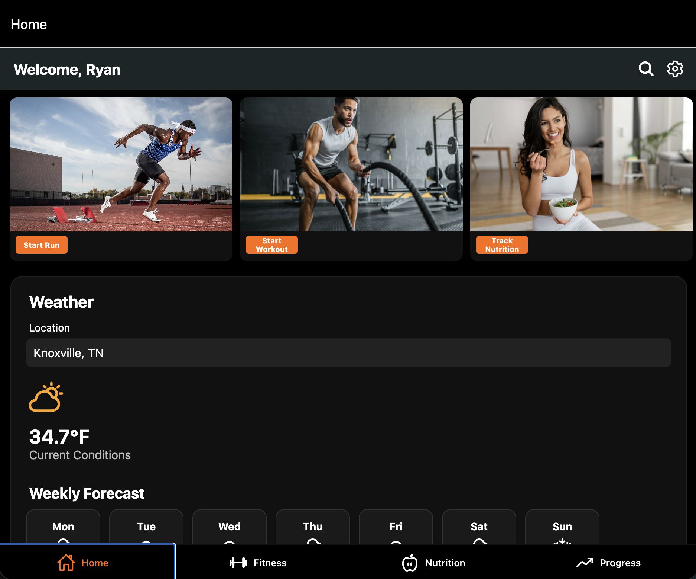

# AimHigh – Fitness Tracking & Progress Visualization App

---

## Team Members

- Ryan Grychowski -- [@rgrychow](https://github.com/rgrychow) 
- Camden Reed --[@clumzycodes](https://github.com/clumzycodes) 
- Matthew Ward-- [@mwar79](https://github.com/mward79) 
- Om Patel -- [@ompatel-2347](https://github.com/ompatel-2347) 
- Hogan OHara-- [@hohara29](https://github.com/hohara29) 

---

## Product Snapshot

  

---

## Description of the Product

**AimHigh** is a mobile fitness application designed to help users take control of their workouts, nutrition, and overall health through interactive progress tracking and cloud-based data storage.

The app allows users to:
- Log workouts, exercises, sets, reps, and weights.
- Track progress over time with clean graphs and trend visualizations.
- Sync data to Firebase for safe cloud storage and cross-device access.
- Edit and maintain personal profiles with nutrition targets and activity logs.

Built with React Native (Expo) and Firebase, AimHigh provides a modern, simple, and intuitive platform for users to visualize their growth and stay consistent in their fitness goals.

---

## Installation

### Prerequisites
Before installing AimHigh, ensure that you have the following installed:
- **Node.js** (v18 or later)
- **npm** 
- **Expo CLI** (installed globally)
- A **Firebase project** (for authentication and database)
https://github.com/rgrychow/COSC340-TeamProject.git

### Clone the Repository

``git clone https://github.com/COSC340-TeamProject.git``

``cd AimHigh/AimHigh``

### Install Dependencies

Make sure Node.js and npm is installed

``npm install``

### Configure Firebase
1. Create a Firebase project at https://firebase.google.com
2. Copy the Firebase config into /firebase.js
3. Enable Authentication (Email/Password) and Firestore Database

## Running the App

With Expo Go:
``npx expo start``
- Scan the QR code with the Expo Go app on your phone
- Or press 'i' (IOS Sim) or 'a' (Android Sim) in the terminal

## Using the App
1. Sign In / Create Acount!
2. Input Nutrition!
3. Track Workouts!
4. View Progress!

## License

[**LICENSE.txt**](LICENSE.txt)

